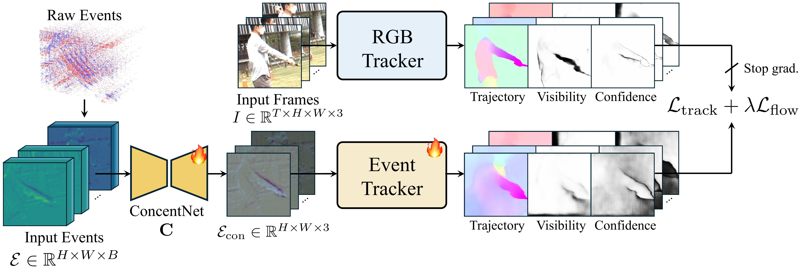
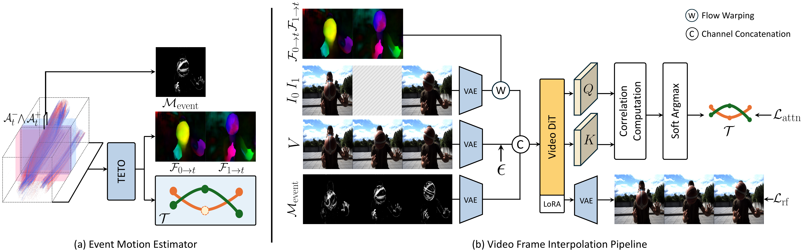

<h1 align="center">TETO<br>Tracking Events with Teacher Observation<br>for Motion Estimation and Frame Interpolation</h1>

<p align="center">
  <a href="https://arxiv.org/pdf/2603.23487"></a>
  <a href="https://sheep1283.github.io/TETO_page/"></a>
</p>

<p align="center">
  <a href="https://github.com/sheep1283/">Jini Yang</a><sup>*1</sup> &nbsp;
  <a href="https://www.linkedin.com/in/eunbeen-hong/">Eunbeen Hong</a><sup>*1</sup> &nbsp;
  <a href="https://scholar.google.com/citations?hl=&user=Eo87mRsAAAAJ">Soowon Son</a><sup>1</sup> &nbsp;
  <a href="https://github.com/guu980-dev/">Hyunkoo Lee</a><sup>1</sup> &nbsp;
  <a href="https://sunghwanhong.github.io/">Sunghwan Hong</a><sup>2</sup> &nbsp;
  <a href="https://cvlab.kau.ac.kr/">Sunok Kim</a><sup>3</sup> &nbsp;
  <a href="https://cvlab.kaist.ac.kr/">Seungryong Kim</a><sup>1</sup>
</p>

<p align="center">
  <sup>1</sup>KAIST AI &nbsp;&nbsp; <sup>2</sup>ETH Zurich &nbsp;&nbsp; <sup>3</sup>Korea Aerospace University<br>
  <sup>*</sup>Equal contribution
</p>

<p align="center">
  
</p>

<p align="center">
  
</p>

## Overview

**TETO** learns event-based motion estimation from only **~25 minutes** of real-world data via RGB teacher distillation — no synthetic data, no manual annotations. The resulting estimator jointly predicts point trajectories and dense optical flow from events in a single forward pass, and these motion signals directly condition a pretrained video diffusion transformer for high-quality frame interpolation.

### Key Highlights

- **Data-efficient learning** from ~25 min of unannotated real-world recordings, orders of magnitude less than prior methods relying on hours of synthetic data
- **Joint flow + tracking** in a single forward pass through teacher-student distillation from a pretrained RGB tracker
- **Motion-aware query sampling** via RANSAC ego-motion decomposition to maximize learning from limited data
- **Video frame interpolation** conditioned on explicit motion priors (flow warping, trajectory-guided attention, event motion mask)

## Code

Code will be released soon. Stay tuned!

## Citation

```bibtex
@misc{yang2026tetotrackingeventsteacher,
      title={TETO: Tracking Events with Teacher Observation for Motion Estimation and Frame Interpolation}, 
      author={Jini Yang and Eunbeen Hong and Soowon Son and Hyunkoo Lee and Sunghwan Hong and Sunok Kim and Seungryong Kim},
      year={2026},
      eprint={2603.23487},
      archivePrefix={arXiv},
      primaryClass={cs.CV},
      url={https://arxiv.org/abs/2603.23487}, 
}
```

## Data

This work uses the [ERF-X170FPS](https://github.com/intelpro/CBMNet) and [EHPT-XC](https://github.com/Chohoonhee/EHPT-XC) datasets, kindly provided by the [KAIST Visual Intelligence Lab](https://vi.kaist.ac.kr/).